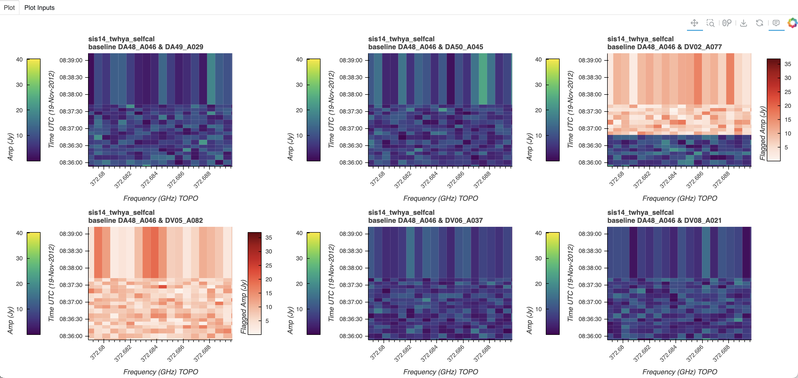
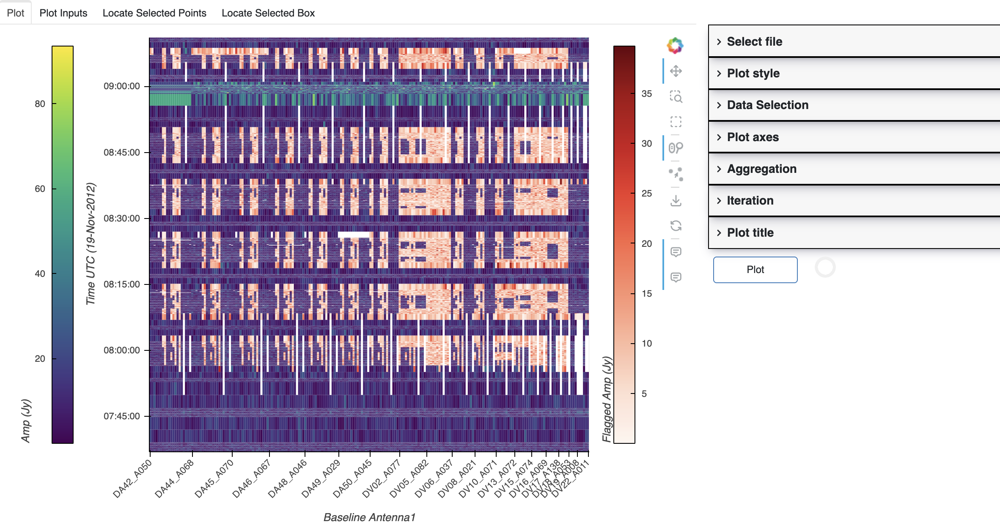

MsRaster
========

.. currentmodule:: applications

MsRaster is an application for 2-dimensional raster visualization and flagging
of visibility and spectrum data. This data must be in the MeasurementSet v4
zarr format, or MeasurementSet v2 table format which will be automatically
converted to MeasurementSet v4 if the necessary packages are installed.

Implementation
--------------

Application Modes
`````````````````

MsRaster creates raster plots for the user to view interactively or save to
disk. The application can be used in three ways from Python:

* create raster plots to export to file

* create interactive Bokeh raster plots to show in a browser window

* use a GUI dashboard in a browser window to select plot parameters and create
  interactive Bokeh raster plots

Data Exploration
````````````````

:xref:`xradio` allows the user to explore MeasurementSet data with a summary of
its metadata, and to make plots of antenna positions and phase center locations
of all fields. These features can be accessed in MsRaster, as well as the
ability to list :xref:`data_groups` and dimension values to aid in selection.

Raster Plots
````````````

MsRaster gives the user flexibility to select data, style the plots, set plot
axes and the complex component, aggregate along one or more data dimensions,
iterate along a data dimension, and layout multiple plots in a grid.  All
parameters available from the MsRaster methods are available in the interactive
GUI.

Using MsRaster to Create Plots
------------------------------

In this simple example with no GUI, we import MsRaster, construct an MsRaster
object, create a raster plot with default parameters, and show the interactive
Bokeh plot in a browser tab::

    >>> from vidavis import MsRaster
    >>> msr = MsRaster(ms=myms)
    >>> msr.plot()
    >>> msr.show()

.. _construct_msraster:

Construct MsRaster Object
`````````````````````````
.. code:: python

    >>> msr = MsRaster(ms=None, log_level='info', log_to_file=True, show_gui=False)

* **ms** (str): path to MSv2 (usually .ms extension) or MSv4 (usually .zarr
  extension) file. Required when show_gui=False.
* **log_level** (str): logging threshold. Options include 'debug', 'info',
  'warning', 'error', 'critical'. Default 'info'.
* **log_to_file** (bool): whether to write log messages to a log file. Default
  True.
* **show_gui** (bool): whether to launch the interactive GUI in a browser tab.
  Default False.

MsRaster can be constructed with the **ms** path to a MSv2 or MSv4 file. If a
MSv2 path is supplied and the correct dependencies have been installed
separately (see :ref:`install_conversion`), the MSv2 will automatically be
converted to the MSv4 zarr format in the same directory as the MSv2, with the
extension *.ps.zarr*. For more information on the MSv4 data format, see the
XRADIO
`Measurement Set Tutorial <https://xradio.readthedocs.io/en/latest/measurement_set/tutorials/measurement_set_tutorial.html>`_.

.. warning::
   MSv2 files will be converted to zarr using the xradio default partitioning:
   **data description** (spectral window and polarization setup), **observation
   mode**, and **field**.  If the MSv2 to be converted has numerous fields, such
   as a mosaic, it is best to
   `convert the MSv2 to zarr <https://xradio.readthedocs.io/en/latest/measurement_set/schema_and_api/measurement_set_api.html#xradio.measurement_set.convert_msv2_to_processing_set>`_
   without field partitioning, prior to using MsRaster.

The **log_level** can be set to the desired level, with log messages output to
the Python console.  When the **log_to_file** option is True (default), log
messages will also be written to the file *msraster-<timestamp>.log* in the
current directory.

At construction, set whether plot parameters will be set in the Python console
or a script (**showgui** is False) or in the interactive GUI (**showgui** is True).
When the GUI is shown, using MsRaster functions will not update the GUI input
parameters or the plot. The **ms** parameter is required when **showgui** is False,
but optional when this path can be set in the GUI.

.. _explore_data:

Explore MS Data
```````````````

MsRaster may be used to explore the MeasurementSet for plotting. The
*.zarr* file is opened as an :xref:`xradio` ProcessingSetXdt, which is an
:xref:`xarray` DataTree composed of MSv4 DataTrees (see `Measurement Set Tutorial
<https://xradio.readthedocs.io/en/latest/measurement_set/tutorials/measurement_set_tutorial.html>`_
for more information). The :xref:`xradio` custom functions for data exploration
in ProcessingSetXdt are available in MsRaster.

.. _data_groups:

Some functions require that the :xref:`data_groups` name is specified. Data
groups are a set of related visibility/spectrum data, uvw, flags, and weights.
To see the available data groups in the ProcessingSetXdt::

    >>> msr.data_groups(show=False)

* **show** (bool): whether to show the data groups in a readable format, or
  return the data groups dictionary. Default False (return the dictionary).

The following examples are for a dataset with *base*, *corrected*, and *model*
data groups::

    >>> groups = msr.data_groups()
    >>> groups
    {'base': {'correlated_data': 'VISIBILITY', 'date': '2025-08-19T18:06:03.322237+00:00', 'description': "Data group derived from the data column 'VISIBILITY' of an MSv2 converted to MSv4", 'field_and_source': 'field_and_source_base_xds', 'flag': 'FLAG', 'uvw': 'UVW', 'weight': 'WEIGHT'}, 'corrected': {'correlated_data': 'VISIBILITY_CORRECTED', 'date': '2025-08-19T18:06:03.322249+00:00', 'description': "Data group derived from the data column 'VISIBILITY_CORRECTED' of an MSv2 converted to MSv4", 'field_and_source': 'field_and_source_corrected_xds', 'flag': 'FLAG', 'uvw': 'UVW', 'weight': 'WEIGHT'}, 'model': {'correlated_data': 'VISIBILITY_MODEL', 'date': '2025-08-19T18:06:03.322251+00:00', 'description': "Data group derived from the data column 'VISIBILITY_MODEL' of an MSv2 converted to MSv4", 'field_and_source': 'field_and_source_model_xds', 'flag': 'FLAG', 'uvw': 'UVW', 'weight': 'WEIGHT'}}
    >>> msr.data_groups(show=True)
    base :
        correlated_data = VISIBILITY
        date = 2025-08-19T18:06:03.322237+00:00
        description = Data group derived from the data column 'VISIBILITY' of an MSv2 converted to MSv4
        field_and_source = field_and_source_base_xds
        flag = FLAG
        uvw = UVW
        weight = WEIGHT
    corrected :
        correlated_data = VISIBILITY_CORRECTED
        date = 2025-08-19T18:06:03.322249+00:00
        description = Data group derived from the data column 'VISIBILITY_CORRECTED' of an MSv2 converted to MSv4
        field_and_source = field_and_source_corrected_xds
        flag = FLAG
        uvw = UVW
        weight = WEIGHT
    model :
        correlated_data = VISIBILITY_MODEL
        date = 2025-08-19T18:06:03.322251+00:00
        description = Data group derived from the data column 'VISIBILITY_MODEL' of an MSv2 converted to MSv4
        field_and_source = field_and_source_model_xds
        flag = FLAG
        uvw = UVW
        weight = WEIGHT

.. _summary:

The ProcessingSetXdt metadata for a specified :xref:`data_groups` name can be
displayed in a tabular format.  These column names and values can be used to
select the ProcessingSetXdt (see ``select_ps()`` in :ref:`select_data`)::

    >>> msr.summary(data_group='base', columns=None)

* **data_group** (str): name of data group for summary.  Default 'base'.
* **columns** (str, list, None): which summary columns to display.  Default None
  shows all columns. Column names may be selected with a string or list.
  Setting columns to 'by_ms' displays the summary in a readable format for each
  MeasurementSetXdt in the ProcessingSetXdt.

By default, the entire summary for the base data group is shown::

    >>> msr.summary()
                        name  \
    0  sis14_twhya_selfcal_0   
    1  sis14_twhya_selfcal_1   
    2  sis14_twhya_selfcal_2   
    3  sis14_twhya_selfcal_3   

                                                                             scan_intents  \
    0  [CALIBRATE_BANDPASS#ON_SOURCE, CALIBRATE_PHASE#ON_SOURCE, CALIBRATE_WVR#ON_SOURCE]   
    1     [CALIBRATE_AMPLI#ON_SOURCE, CALIBRATE_PHASE#ON_SOURCE, CALIBRATE_WVR#ON_SOURCE]   
    2                                [CALIBRATE_PHASE#ON_SOURCE, CALIBRATE_WVR#ON_SOURCE]   
    3                                                          [OBSERVE_TARGET#ON_SOURCE]   

                    shape      execution_block_UID polarization  \
    0   (40, 210, 384, 2)  uid://A002/X554543/X207     [XX, YY]   
    1   (20, 190, 384, 2)  uid://A002/X554543/X207     [XX, YY]   
    2   (80, 210, 384, 2)  uid://A002/X554543/X207     [XX, YY]   
    3  (270, 210, 384, 2)  uid://A002/X554543/X207     [XX, YY]   

                              scan_name                          spw_name  \
    0                           [33, 4]  ALMA_RB_07#BB_2#SW-01#FULL_RES_0   
    1                               [7]  ALMA_RB_07#BB_2#SW-01#FULL_RES_0   
    2  [10, 14, 18, 22, 26, 30, 34, 38]  ALMA_RB_07#BB_2#SW-01#FULL_RES_0   
    3          [12, 16, 20, 24, 28, 36]  ALMA_RB_07#BB_2#SW-01#FULL_RES_0   

         spw_intents              field_name               source_name line_name  \
    0  [UNSPECIFIED]  [3c279_6, J0522-364_0]  [J0522-364_0, Unknown_5]        []   
    1  [UNSPECIFIED]               [Ceres_2]             [J1037-295_2]        []   
    2  [UNSPECIFIED]           [J1037-295_3]                [TW Hya_3]        []   
    3  [UNSPECIFIED]              [TW Hya_5]                 [3c279_4]        []   

                             field_coords session_reference_UID  \
    0                  Multi-Phase-Center                   ---   
    1    [fk5, 6h10m15.95s, 23d22m06.91s]                   ---   
    2  [fk5, 10h37m16.08s, -29d34m02.81s]                   ---   
    3  [fk5, 11h01m51.80s, -34d42m17.37s]                   ---   

         scheduling_block_UID             project_UID  start_frequency  \
    0  uid://A002/X327408/X73  uid://A002/X327408/X6f     3.725331e+11   
    1  uid://A002/X327408/X73  uid://A002/X327408/X6f     3.725331e+11   
    2  uid://A002/X327408/X73  uid://A002/X327408/X6f     3.725331e+11   
    3  uid://A002/X327408/X73  uid://A002/X327408/X6f     3.725331e+11   

       end_frequency  
    0   3.727669e+11  
    1   3.727669e+11  
    2   3.727669e+11  
    3   3.727669e+11

If a subset of columns is of interest, set **columns** to one or more column
names::

    >>> msr.summary(data_group='base', columns='intents')
    >>> msr.summary(data_group='base', columns=['spw_name', 'shape'])
    >>> msr.summary(data_group='base', columns=['spw_name', 'start_frequency', 'end_frequency'])

To view the summary information grouped by MSv4, set **columns** to 'by_ms'
(only the first MS is shown here)::

    >>> msr.summary(data_group='base', columns='by_ms')
    name: sis14_twhya_selfcal_0
    scan_intents: ['CALIBRATE_BANDPASS#ON_SOURCE', 'CALIBRATE_PHASE#ON_SOURCE', 'CALIBRATE_WVR#ON_SOURCE']
    shape: 40 times, 210 baselines, 384 channels, 2 polarizations
    execution_block_UID: uid://A002/X554543/X207
    polarization: ['XX' 'YY']
    scan_name: ['33', '4']
    spw_name: ALMA_RB_07#BB_2#SW-01#FULL_RES_0
    spw_intents: ['UNSPECIFIED']
    field_name: ['3c279_6', 'J0522-364_0']
    source_name: ['J0522-364_0', 'Unknown_5']
    line_name: []
    field_coords: (M) u l
    session_reference_UID: ---
    scheduling_block_UID: uid://A002/X327408/X73
    project_UID: uid://A002/X327408/X6f
    frequency range: 3.725331e+11 - 3.727669e+11

.. _get_dimension_values:

The values in each data dimension may be listed::

    >>> msr.get_dimension_values(dimension)

* **dimension** (str): which dimension to list. Options include 'time',
  'baseline', 'frequency', and 'polarization'. Baseline antennas may be listed
  separately with 'antenna1' and 'antenna2'.

The list of dimension values can be used to select data in the
MeasurementSetXdts (see ``select_ms()`` in :ref:`select_data`)::

    >>> msr.get_dimension_values('polarization')
    ['XX', 'YY']
    >>> msr.select_ms(polarization='XX')

The 'time' dimension is returned as datetime strings in the format
*dd-Mon-YYYY HH:MM:SS*.  Use this format to select time in ``select_ms()``.

The 'baseline' dimension is returned as strings in the format *antenna1 & antenna2*.
Use this format to selection baseline in ``select_ms()``.

.. _plot_antennas:

MsRaster includes the :xref:`xradio` ProcessingSetXdt function to plot antenna
positions, optionally labeled by name::

    >>> msr.plot_antennas(label_antennas=False)

* **label_antennas** (bool): whether to label each antenna in the antenna
  position plot.  Default False.

Without antenna labels, the name can be shown by hovering over an antenna
position. Example plot with antenna labels:

.. image:: _static/antenna_positions.png

MsRaster also includes the :xref:`xradio` ProcessingSetXdt function
``plot_phase_centers()``, which plots the phase center locations of all fields
in a data group::

    >>> msr.plot_phase_centers(data_group='base', label_fields=False)

* **data_group** (str): name of data group with field_and_source_xds to plot.
  Default 'base'.
* **label_fields** (bool): Whether to label each field in the plot.

When **label_fields** is False, the central field is highlighted in red based on
the closest phase center calculation, and the legend shows the central field
name. Otherwise, all fields are named and the central field is red. Sample plot
with **label_fields** set to True:

.. image:: _static/phase_centers.png

.. _style_plot:

Style Raster Plots
``````````````````

Plot style settings may be set and will be used for all plots.  Currently, the
style includes colormaps and whether to show colorbars for unflagged and flagged
data.

    >>> msr.set_style_params(unflagged_cmap='Viridis', flagged_cmap='Reds',
    show_colorbar=True, show_flagged_colorbar=True)

* **unflagged_cmap** (str): colormap for unflagged data. Default 'Viridis'.
* **flagged_cmap** (str): colormap for flagged data. Default 'Reds'.
* **show_colorbar** (bool): whether to show the colorbar for unflagged data.
  Default True.
* **show_flagged_colorbar** (bool): whether to show the colorbar for flagged
  data. Default True.

The show the list of available colormaps::

    >>> msr.colormaps()
    ['Blues', 'Cividis', 'Greens', 'Greys', 'Inferno', 'Magma', 'Oranges',
    'Plasma', 'Purples', 'Reds', 'Turbo', 'Viridis']

In the future, additional style settings may be available and these settings may
be able to be stored in a configuration file rather than set each time.

.. _select_data:

Select Raster Data
``````````````````

MsRaster has two ways to select data: ``select_ps()`` to select a subset of
MeasurementSetXdts in the ProcessingSetXdt,  and ``select_ms()`` to select data
in the MeasurementSetXdts. Use either method to select one of the available data
groups using keyword ``data_group_name`` (see :ref:`data_groups <data_groups>`).

Select ProcessingSetXdt
^^^^^^^^^^^^^^^^^^^^^^^

Processing set selection is based on the :ref:`summary <summary>` and filters
the MeasurementSetXdts in the ProcessingSetXdt::

    select_ps(string_exact_match=True, query=None, **kwargs)

* **string_exact_match** (bool): whether to require exact matches for string
  values (default True) or allow partial matches (False).
* **query** (str): a Pandas query string to apply additional filtering.
* **kwargs** (dict): keyword arguments representing summary column names and values.
    
Since the summary is a Pandas dataframe, a Pandas **query** string may be used
to filter the MeasurementSetXdts included in a ProcessingSetXdt. Keyword
arguments (**kwargs**) use summary column names and *data_group_name* to select
the ProcessingSetXdt::

    >>> msr.select_ps(query='start_frequency > 100e9 AND end_frequency < 200e9')
    >>> msr.select_ps(data_group_name='corrected', field_name='TW Hya_5', scan_name='16', polarization='XX')

The keyword arguments may be passed as a Python dictionary::

    >>> ps_selection = {'field_name': 'TW Hya_5', 'scan_name': '16', 'polarization': 'XX'}
    >>> msr.select_ps(**ps_selection)

The keyword values may be a single value as shown above, or a list of values::

    >>> msr.select_ps(scan_name=['16', '18', '20'])

With ProcessingSetXdt selection, the option for an exact string match (default)
or a partial string match for string values is available using the
**string_exact_match** parameter::

    >>> msr.select_ps(string_exact_match=False, query=None, intents='CALIBRATE_BANDPASS')
    >>> msr.select_ps(string_exact_match=False, query=None, field_name='Venus')

Note the ProcessingSetXdt selection is not applied to the data *in* the
MeasurementSetXdts, unless **exact_string_match** is True and the column name is
'polarization', 'scan_name', or 'field_name'.

For additional explanation and examples, see also `ProcessingSetXdt.query() 
<https://xradio.readthedocs.io/en/latest/measurement_set/schema_and_api/measurement_set_api.html#xradio.measurement_set.ProcessingSetXdt.query>`_.

Select MeasurementSetXdt
^^^^^^^^^^^^^^^^^^^^^^^^

MeasurementSetXdt selection is based on `xarray.Dataset.sel
<https://docs.xarray.dev/en/stable/generated/xarray.Dataset.sel.html>`_
using data groups and dimensions::

    >>> msr.select_ms(indexers=None, method=None, tolerance=None, drop=False, **indexers_kwargs)

* **indexers** (dict): a dict with keys matching dimensions and values given by
  scalars, slices or arrays.
* **method** (str): method to use for inexact matches: None (only exact matches),
  'pad'/'ffill' (propagate last valid index value forward), 'backfill'/'bfill'
  (propagate next valid index value backward), 'nearest' (use nearest valid index
  value). Default None.
* **tolerance** (float): maximum distance between original and new values for
  inexact matches.
* **drop** (bool): whether to drop coordinate variables in *indexers* instead of
  making them scalar. Default False.
* **indexers_kwargs**: the keyword arguments form of indexers.  **indexers** or
  **indexers_kwargs** must be provided.

Indexer keywords include *data_group_name* and dimensions *time*, *baseline*
(for visibilities), *antenna_name* (for spectrum), *frequency*, and *polarization*.
Use :ref:`get_dimension_values <get_dimension_values>` for a list of valid
dimension values to select. A set of baselines may also be selected by antenna
with *antenna1* and *antenna2*::

    >>> msr.select_ms(antenna1='DA44_A068')

Numeric value selection supports inexact matches using parameters **method** and
**tolerance**. Here, the nearest frequency value within 100 MHz of 372.6 GHz is
selected::

    >>> msr.select_ms(frequency=3.726e+11, method='nearest', tolerance=1e+8)

Values may be a single value, a list, or a slice. Time selection must be in
string format 'dd-Mon-YYYY HH:MM:SS' as shown in
``get_dimension_values('time')``::

    >>> msr.select_ms(polarization=['XX', 'YY']
    >>> msr.select_ms(time=slice('19-Nov-2012 09:00:00', '19-Nov-2012 09:12:00'))

For additional explanation and examples, see `MeasurementSetXdt.sel() 
<https://xradio.readthedocs.io/en/latest/measurement_set/schema_and_api/measurement_set_api.html#xradio.measurement_set.MeasurementSetXdt.sel>`_.

.. warning::
   All selections using ``select_ps()`` and ``select_ms()`` are cumulative, with
   each selection acting on the previously-selected ProcessingSetXdt and
   MeasurementSetXdts.

To clear previous selections and return to the original ProcessingSetXdt::

    >>> msr.clear_selection()

.. note::
  **Automatic selection**: Since MsRaster creates a 2D plot from 4D data, some
  selections must be done automatically if not selected by the user. These
  selections include:

    * **spw name**: for consistent data shapes, the first spectral window (by
      time) is selected.
    * **data group**: default 'base'.
    * **data dimensions**:  the dimensions not chosen for *x_axis*,
      *y_axis*, aggregation *agg_axis* or iteration *iter_axis* are
      automatically selected. After user selections are applied, the set of
      dimension values are sorted, and the first is used. Time and frequency are
      numeric values. For baseline, names are formed as 'ant1_name & ant2_name'
      strings and sorted, then the first pair in the list is selected. For
      polarization, the names are converted to `casacore Stokes enum
      <https://github.com/casacore/casacore/blob/5a8df94738bdc36be27e695d7b14fe949a1cc2df/measures/Measures/Stokes.h#L64>`_
      values, sorted, and the first in the list is selected and converted back
      to a name for value selection.

.. _create_plot:

Create Raster Plot
``````````````````

Use ``plot()`` to create each raster plot, which can then be shown (see
:ref:`show_plot`) or saved (see :ref:`save_plot`)::

    >>> msr.plot(x_axis='baseline', y_axis='time', vis_axis='amp', aggregator=None,
    agg_axis=None, iter_axis=None, iter_range=None, subplots=None, color_mode=None,
    color_range=None, title=None, clear_plots=True)

* **x_axis**, **y_axis** (str): select the axes to plot from the data
  dimensions 'time', 'baseline' (for visibility data), 'antenna_name' (for
  spectrum data), 'frequency', and 'polarization'. Default **x_axis** is
  'baseline', equivalent to 'antenna_name' for spectrum data. Default **y_axis**
  is 'time'.

* **vis_axis** (str): the complex component of the visibility data has options
  'amp', 'phase', 'real', and 'imag'. For spectrum data, only 'amp' and 'real'
  are valid. Default is 'amp', equivalent to 'real' for spectrum data.

* **aggregator** (None, str): the reduction function to apply along the
  **agg_axis** dimension(s) of all correlated data in the data group.
  Aggregator options include 'max', 'mean', 'min', 'std', 'sum', and 'var'. The
  reduction is applied after the **vis_axis** component is calculated. Flags and
  weights are not used in the aggregation but are aggregated. Default None.

* **agg_axis** (None, str, list): which dimension(s) to apply the **aggregator**
  across. Cannot include **x_axis** or **y_axis**. Ignored if **aggregator** is None.
  The entire dimension(s) are aggregated. If **agg_axis** is a single dimension,
  the remaining dimension is selected automatically as described above. If
  **agg_axis** is None, *all* remaining dimensions are aggregated. Default None.

* **iter_axis** (None, str): dimension along which to iterate to create multiple
  plots. Cannot be **x_axis** or **y_axis**. Select the iteration index range with
  **iter_range**. Default None.

* **iter_range** (None, tuple): (start, end) inclusive index values for creating
  iteration plots. Use (0, -1) for all iterations.  Warning: you may trigger a
  MemoryError with many iterations.  Iterated plots can be shown or saved in a
  grid (see **subplots**) or saved individually (see :ref:`save_plot`). Default
  None is equivalent to (0, 0), first iteration only.

* **subplots** (None, tuple): set a plot layout of (rows, columns). Use when
  multiple plots are created with **iter_axis** and **iter_range**, or with
  **clear_plots** set to False.  If the layout size is less than the number of
  plots, **subplots** will limit the plots shown in the layout. If the number of
  plots is less than the **subplots** size, the plots will appear in the layout
  according to the number of columns but fewer or incomplete rows. When multiple
  plots are created when **clear_plots** is False, the *last* **subplots** setting
  will be used for the layout. Default None is equivalent to (1, 1), a single
  plot.

* **color_mode** (None, str): whether to limit the colorbar range for amplitudes.
  Options include None (use data limits), 'auto' (calculate limits for amplitude),
  and 'manual' (use **color_range**). 'auto' is equivalent to None if **vis_axis** is
  not 'amp'.  'manual' is equivalent to None if **color_range** is None. Automatic
  limits for amplitudes are calculated from statistics for the unflagged data in
  the spectral window, which uses :xref:`graphviper` MapReduce for fast
  computation. The range is clipped to 3-sigma limits to brighten weaker data
  values. Default None (use data limits).

* **color_range** (None, tuple): (min, max) of colorbar to use if **color_mode**
  is 'manual', else ignored. Default None (use data limits).

* **title** (None, str): plot title. Options include None, 'ms' (generate
  a title from the **ms** name, appended with **iter_axis** value if any), or a
  custom title string. Default None (no plot title).

* **clear_plots** (bool): whether to clear the list of any previous plot(s). Set
  to False to create multiple plots and show them in a layout with **subplots**.
  This option is not currently available in the interactive GUI. Default True
  (remove previous plots).

**Examples**:

* Aggregation: time vs. baseline averaged over frequency, with the first
  polarization selected automatically:

    >>> msr.plot(x_axis='baseline', y_axis='time', aggregator='mean', agg_axis='frequency')

* Aggregation: time vs. baseline averaged over frequency, with polarization
  selection:

    >>> msr.plot(x_axis='baseline', y_axis='time', selection={'polarization': 'YY'},
    aggregator='mean', agg_axis='frequency')

* Aggregation: time vs. baseline averaged over frequency and polarization
  (equivalent to ``agg_axis=['frequency', 'polarization']``):

    >>> msr.plot(x_axis='baseline', y_axis='time', aggregator='mean')

* Iteration layout: time vs. baseline for the first six frequencies in 2 rows,
  with the first polarization selected automatically:

    >>> msr.plot(iter_axis='frequency', iter_range=(0, 5), subplots=(2, 3))

* Multiple plots layout: time vs. baseline for 'amp' and 'phase' in one row,
  with the first frequency and polarization selected automatically:

    >>> msr.plot(vis_axis='amp')
    >>> msr.plot(vis_axis='phase', subplots=(1, 2), clear_plots=False)

* Aggregation and iteration layout: time vs. frequency for the max across
  baselines, iterated over all polarizations, in a 2x2 layout with a clipped
  colorbar range:

    >>> msr.plot(x_axis='frequency', y_axis='time', vis_axis='amp', aggregator='max',
    agg_axis='baseline', iter_axis='polarization', iter_range=(0, -1), subplots=(2, 2),
    color_mode='auto')

.. _show_plot:

Show Raster Plot
````````````````

After an interactive Bokeh plot is created (see :ref:`create_plot`), it may be
shown in a browser tab with ``show()``, which has no parameters:

    >>> msr.show()

To show the plot, :xref:`holoviews` renders the plot and saves it to an HTML
file in a temporary directory, then automatically opens the file in the browser.
The white areas in this plot contain no data, and the hover tool shows the plot
data at the cursor position (x, y, and vis axis values):

.. image:: _static/msraster_cursor.png

To the right of the plot, the toolbar contains the Bokeh icons for plot tools.
At the top of the toolbar, the Bokeh icon is a link to the Bokeh website, and
below it are the *pan*, *box zoom*, *box select*, *wheel zoom*, *point draw*,
*save*, *reset*, and *hover* tool icons. By default, the pan, wheel zoom, and
hover tools are activated for the plot, indicated by the line to the left of the
icons. Bokeh plot tools can be enabled or disabled by clicking on the tool icon.

In addition to the hover information, when the cursor moves over the plot, a
Cursor Location box appears to the right of the plot to show the coordinates and
data variables associated with the cursor position.

The plot is shown with four tabs at the upper left.  The first tab (**Plot**),
which is active by default, contains the plot and the cursor location box. The
second tab (**Plot Inputs**) shows the parameters used to make the raster
plot (including automatic selections), sorted alphabetically:

.. image:: _static/msraster_plot_inputs.png
   :width: 75%

The remaining tabs are for selecting areas of the plot to show the location of
the points. See :ref:`locate_data` for a detailed description.

.. note::

   The Locate features are disabled in a plot when a new plot is created with
   ``plot()``, since the plot data needed for the metadata is no longer
   available. The cursor box and locate tabs are removed, but the hover tool is
   still active. The new plot is shown in a new tab with locate features.

If multiple plots were created (with **iter_axis**, or **clear_plots** set to
False) in a **subplots** layout, the plots are connected so that the Bokeh plot
tools such as pan and zoom act on all plots in the layout.  The following layout
plot demonstrates the same zoom level, with the shared toolbar at the upper
right:



.. note::

   The Locate features are not available when multiple plots are shown in a
   layout, but the Hover tool is active.

.. _locate_data:

Locate Plot Data
````````````````

Location information for selected points can be obtained for the **cursor**
position, for points selected using the **Point Draw** tool, or for points in a
box selected with the **Box Select** tool.

**Cursor:**

When the cursor is positioned over the plot, the hover values are shown in the
plot as well as additional Cursor Location information shown to the right of the
plot:

.. image:: _static/msraster_cursor.png

**Select Points:**

Any number of points may be selected, moved, or changed by activating the
**Point Draw** tool. To select a point, tap anywhere on the plot. To move a
point, tap and drag the point to the desired position. To delete a point, tap
the point to select it then press BACKSPACE or DELETE.

**Select Box:**

A box may be selected or deleted by activating the **Box Select** tool. To
select a box, tap and drag across the plot to draw a rectangle. A new box
selection will replace the old box. To clear the box selection, press the ESC
key.

**Locate Selected Points:**

The location information for each selected point is displayed in the Locate tabs
and in the log file. Points selected individually with **Point Draw** will
appear in the third tab (**Locate Selected Points**), and points selected in a
box with **Box Select** will appear in the fourth tab (**Locate Selected Box**).
Only one selection tool can be activated at a time. In the following plot,
several unflagged points and a box of flagged points are
selected in the plot, and the **Point Draw** tool is activated:

.. image:: _static/msraster_locate_points.png

The location information shows the coordinate and data variable information
associated with each point. For example, in the **Locate Selected Box** tab, the
number of points in the box is shown, then the points are listed with a divider
between them. Only the **first 100** points in the selected box are located,
starting with the first row of the box:

.. image:: _static/msraster_locate_box.png

.. warning::
   Although multiple boxes may be selected by pressing the SHIFT key, the list
   of points for each box in the Locate Selected Box tab will be cleared with
   each new box selection rather than appended. However, the points in each box
   can be accessed in the log file, in the order the boxes are created.

.. _save_plot:

Save Raster Plot
````````````````

After a plot is created (see :ref:`create_plot`), it may be saved to a file with
``save()``.

    >>> msr.save(filename='', fmt='auto', width=900, height=600)

* **filename** (str): name of file to save. Default '' saves the plot as
  {ms_name}_raster.{ext}). If fmt is not set, the plot will be saved as .png.
* **fmt** (str): format of file to save ('png', 'html', or 'gif'). Default
  'auto' infers the format from **filename** extension.
* **width** (int): width of exported plot in pixels.
* **height** (int): height of exported plot in pixels.

Multiple plots can be saved in a layout using the **subplots** parameter of the
:ref:`create_plot` ``plot()`` function. Each plot in the layout will have the
size *(width, height)*, resulting in a layout plot of size *(width * columns,
height * rows)* pixels. This layout plot is saved to a single file with
**filename**.

However, if iteration plots were created and **subplots** is a single plot
(None or (1, 1)), the iteration plots will be saved individually with a plot
index appended to the filename according to the **iter_range** index range:
*{filename}_{index}.{ext}*. See examples below.

When ``save()`` is called, the plot is exported to an HTML file.  When *fmt* is
'png', the plot is rendered in memory then a screenshot is captured to create a
PNG file. For 'svg' export, Bokeh replaces the HTML5 Canvas plot output with a
Scalable Vector Graphics (SVG) element that can be edited in image editing
programs such as Adobe Illustrator and/or converted to PDF.

.. warning::
   If you have rendered the plot with ``show()``, it is much faster to save
   the plot with the Bokeh save tool than with ``save()``.

**Iteration save() examples**:

* Create plots for the first four frequencies, and save them in a 2x2 layout:

    >>> msr.plot(iter_axis='frequency', iter_range=(0, 3), subplots=(2, 2))
    >>> msr.save(filename='iter_freq_layout.png')

* Create plots for a range of frequencies, and save them *individually* with an
  index (in this example: iter_freq_10.png, iter_freq_11.png, iter_freq_12.png,
  iter_freq_13.png):

    >>> msr.plot(iter_axis='frequency', iter_range=(10, 13))
    >>> msr.save(filename='iter_freq.png')

* Create plots for all polarizations, and save them individually with an index
  (in this case, iter_pol_0.png, iter_pol_1.png, etc. depending on the number of
  polarizations):

    >>> msr.plot(iter_axis='polarization', iter_range=(0, -1))
    >>> msr.save(filename='iter_pol.png')

.. _interactive_gui:

Use Interactive GUI
```````````````````

As mentioned in :ref:`construct_msraster`, set **show_gui** to True to launch
the interactive GUI.  In this case, the **ms** path can be supplied but is not
required.

.. code:: python

    >>> msr = MsRaster(ms=None, log_level='info', show_gui=True)

The GUI will immediately launch in a browser tab.  If **ms** is set, a plot with
default parameters is created and shown in the GUI. As with ``show()``, the plot
is shown in the first tab (**Plot**), the inputs for the plot are shown in the
second tab (**Plot Inputs**), and location information for points selected with
plot tools are shown in the remaining two tabs (**Locate Selected Points** and
**Locate Selected Box**; see :ref:`locate_data`). By default, the pan, wheel
zoom, and hover tools are activated:



**Plot Settings:**

When using the interactive GUI, settings for the plot may be changed in the
**Plot Settings** tab. This allows the user to set all of the parameters in the
MsRaster functions ``set_style_params``, ``select_ps``, ``select_ms``, and
``plot``, described above:

.. image:: _static/msraster_plot_settings.png

In this accordion-style panel, each section may be expanded to access its
settings. The **Plot** button below the panel will change from outline to solid
when the settings change. Click **Plot** to create the plot. The spinner to the
right of the button will rotate until the plot is complete and shown in the
**Plot** tab, with the updated plot inputs in the **Plot Inputs** tab.

* :ref:`construct_msraster` parameters:

  * **Select file**: ``ms``

* :ref:`style_plot` parameters:

  * **Plot style**: ``unflagged_cmap``, ``flagged_cmap``, ``show_colorbar``,
    ``show_flagged_colorbar``

* :ref:`select_data` parameters:

  * **Data Selection**:

    * **Select ProcessingSetXdt**: query, summary column names
    * **Select MeasurementSetXdt**: data group, dimensions, antenna1 and antenna2

* :ref:`create_plot` parameters:

  * **Plot axes**: ``x_axis``, ``y_axis``, ``vis_axis``
  * **Aggregation**: ``aggregator``, ``agg_axis``
  * **Iteration**: ``iter_axis``, ``iter_range``, ``subplots``
  * **Plot title**: ``title``

.. note::
   Currently, the only way to create multiple plots in a layout is iteration.
   Iterated plots in a layout will be shown in a **new browser tab**.
