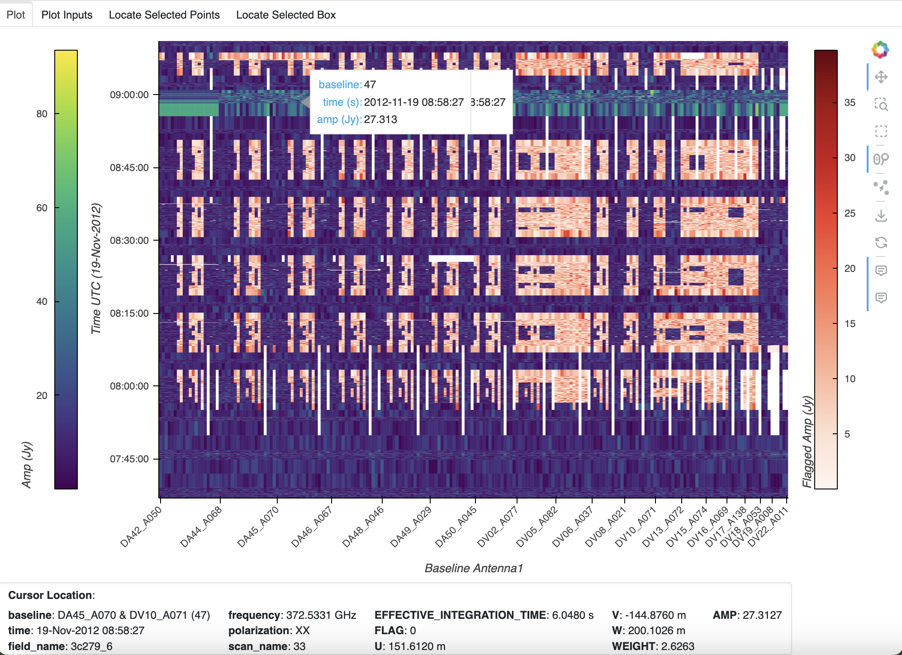

MsRaster
========

.. currentmodule:: applications

MsRaster is an application for 2-dimensional raster visualization and flagging
of visibility and spectrum data. This data must be in the MeasurementSet v4.0.0
zarr format, or MeasurementSet v2 format which will be automatically converted
to MeasurementSet v4 if the necessary packages are installed.

Implementation
--------------

Application Modes
`````````````````

MsRaster creates raster plots for the user to view interactively or save to
disk. The application can be used in three ways from Python:

* create raster plots to export to file

* create interactive Bokeh raster plots to show in a browser window

* use a GUI dashboard in a browser window to select plot parameters and create
  interactive Bokeh raster plots

Data Exploration
````````````````

:xref:`xradio` allows the user to explore MeasurementSet data with a summary of
its metadata, and to make plots of antenna positions and phase center locations
of all fields. These features can be accessed in MsRaster, as well as the
ability to list :xref:`data_groups` and dimension values to aid in selection.

Raster Plots
````````````

MsRaster gives the user flexibility to select data, style the plots, set plot
axes and the complex component, aggregate along one or more data dimensions,
iterate along a data dimension, and layout multiple plots in a grid.  All
parameters available from the MsRaster methods are available in the interactive
GUI.

Using MsRaster to Create Plots
------------------------------

In this simple example with no GUI, we import MsRaster, construct an MsRaster
object, create a raster plot with default parameters, and show the interactive
Bokeh plot in a browser tab::

    from vidavis import MsRaster
    msr = MsRaster(ms=myms)
    msr.plot()
    msr.show()

.. _construct_msraster:

Construct MsRaster Object
`````````````````````````
.. code:: python

    >>> msr = MsRaster(ms=None, log_level='info', log_to_file=True, show_gui=False)

* ``ms`` (str): path to MSv2 (usually .ms extension) or MSv4 (usually .zarr
  extension) file. Required when show_gui=False.
* ``log_level`` (str): logging threshold. Options include 'debug', 'info',
  'warning', 'error', 'critical'.
* ``log_to_file`` (bool): whether to write log messages to a log file.
* ``show_gui`` (bool): whether to launch the interactive GUI in a browser tab.

MsRaster can be constructed with the ``ms`` path to a MSv2 or MSv4 file. If a
MSv2 path is supplied and the correct dependencies have been installed
separately (see :ref:`install_conversion`), the MSv2 will automatically be
converted to the MSv4 zarr format in the same directory as the MSv2, with the
extension **.ps.zarr**. For more information on the MSv4 data format, see the
XRADIO
`Measurement Set Tutorial <https://xradio.readthedocs.io/en/latest/measurement_set/tutorials/measurement_set_tutorial.html>`_.

.. warning::
   MSv2 files will be converted to zarr using the xradio default partitioning:
   **data description** (spectral window and polarization setup), **observation
   mode**, and **field**.  If the MSv2 to be converted has numerous fields, such
   as a mosaic, it is best to
   `convert the MSv2 to zarr <https://xradio.readthedocs.io/en/latest/measurement_set/schema_and_api/measurement_set_api.html#xradio.measurement_set.convert_msv2_to_processing_set>`_
   without field partitioning prior to using MsRaster.

The ``log_level`` can be set to the desired level, with log messages output to
the Python console.  When the ``log_to_file`` option is enabled (default), log
messages will also be written to the file *msraster-<timestamp>.log* in the
current directory.

At construction, set whether plots will be constructed using MsRaster functions
(``showgui=False``) or using the interactive GUI (``showgui=True``).  When the
GUI is shown, using MsRaster functions does not update the GUI widget selections
or the plot. The ``ms`` parameter is required when ``showgui=False``, but
optional when this path can be set in the GUI.

.. _explore_data:

Explore MS Data
```````````````

Several MsRaster functions are available for exploring the MeasurementSet. The
**.zarr** file is opened as an :xref:`xradio` ProcessingSet, which is an :xref:`xarray`
DataTree composed of MSv4s (see
`Measurement Set Tutorial <https://xradio.readthedocs.io/en/latest/measurement_set/tutorials/measurement_set_tutorial.html>`_
for more information). :xref:`xradio` has added custom functions for data
exploration in its ProcessingSetXdt class, which are available in MsRaster.

.. _data_groups:

Some functions require that the :xref:`data_groups` name is specified. Data groups are
a set of related visibility/spectrum data, uvw, flags, and weights. Use
``data_groups()`` to get a list of the data groups available in the MS::

    >>> msr.data_groups()
    {'base', 'model', 'corrected'}

.. _summary:

Use ``summary()`` to view ProcessingSetXdt metadata for a specified
:xref:`data_groups` name, displayed in a tabular format.  These column names and
values can be used to do selection for a plot (see ``select_ps()`` in
:ref:`select_data`)::

    >>> msr.summary(data_group='base', columns=None)
                        name  \
    0  sis14_twhya_selfcal_0   
    1  sis14_twhya_selfcal_1   
    2  sis14_twhya_selfcal_2   
    3  sis14_twhya_selfcal_3   

                                                                             scan_intents  \
    0  [CALIBRATE_BANDPASS#ON_SOURCE, CALIBRATE_PHASE#ON_SOURCE, CALIBRATE_WVR#ON_SOURCE]   
    1     [CALIBRATE_AMPLI#ON_SOURCE, CALIBRATE_PHASE#ON_SOURCE, CALIBRATE_WVR#ON_SOURCE]   
    2                                [CALIBRATE_PHASE#ON_SOURCE, CALIBRATE_WVR#ON_SOURCE]   
    3                                                          [OBSERVE_TARGET#ON_SOURCE]   

                    shape      execution_block_UID polarization  \
    0   (40, 210, 384, 2)  uid://A002/X554543/X207     [XX, YY]   
    1   (20, 190, 384, 2)  uid://A002/X554543/X207     [XX, YY]   
    2   (80, 210, 384, 2)  uid://A002/X554543/X207     [XX, YY]   
    3  (270, 210, 384, 2)  uid://A002/X554543/X207     [XX, YY]   

                              scan_name                          spw_name  \
    0                           [33, 4]  ALMA_RB_07#BB_2#SW-01#FULL_RES_0   
    1                               [7]  ALMA_RB_07#BB_2#SW-01#FULL_RES_0   
    2  [10, 14, 18, 22, 26, 30, 34, 38]  ALMA_RB_07#BB_2#SW-01#FULL_RES_0   
    3          [12, 16, 20, 24, 28, 36]  ALMA_RB_07#BB_2#SW-01#FULL_RES_0   

         spw_intents              field_name               source_name line_name  \
    0  [UNSPECIFIED]  [3c279_6, J0522-364_0]  [J0522-364_0, Unknown_5]        []   
    1  [UNSPECIFIED]               [Ceres_2]             [J1037-295_2]        []   
    2  [UNSPECIFIED]           [J1037-295_3]                [TW Hya_3]        []   
    3  [UNSPECIFIED]              [TW Hya_5]                 [3c279_4]        []   

                             field_coords session_reference_UID  \
    0                  Multi-Phase-Center                   ---   
    1    [fk5, 6h10m15.95s, 23d22m06.91s]                   ---   
    2  [fk5, 10h37m16.08s, -29d34m02.81s]                   ---   
    3  [fk5, 11h01m51.80s, -34d42m17.37s]                   ---   

         scheduling_block_UID             project_UID  start_frequency  \
    0  uid://A002/X327408/X73  uid://A002/X327408/X6f     3.725331e+11   
    1  uid://A002/X327408/X73  uid://A002/X327408/X6f     3.725331e+11   
    2  uid://A002/X327408/X73  uid://A002/X327408/X6f     3.725331e+11   
    3  uid://A002/X327408/X73  uid://A002/X327408/X6f     3.725331e+11   

       end_frequency  
    0   3.727669e+11  
    1   3.727669e+11  
    2   3.727669e+11  
    3   3.727669e+11

If a subset of columns is of interest, set the ``columns`` parameter to one or
more column names::

    >>> msr.summary(data_group='base', columns='intents')
    >>> msr.summary(data_group='base', columns=['spw_name', 'shape'])
    >>> msr.summary(data_group='base', columns=['spw_name', 'start_frequency', 'end_frequency'])

To view the summary information grouped by MSv4, set ``columns='by_ms'`` (only
the first MS is shown here)::

    >>> msr.summary(data_group='base', columns='by_ms')
    name: sis14_twhya_selfcal_0
    scan_intents: ['CALIBRATE_BANDPASS#ON_SOURCE', 'CALIBRATE_PHASE#ON_SOURCE', 'CALIBRATE_WVR#ON_SOURCE']
    shape: 40 times, 210 baselines, 384 channels, 2 polarizations
    execution_block_UID: uid://A002/X554543/X207
    polarization: ['XX' 'YY']
    scan_name: ['33', '4']
    spw_name: ALMA_RB_07#BB_2#SW-01#FULL_RES_0
    spw_intents: ['UNSPECIFIED']
    field_name: ['3c279_6', 'J0522-364_0']
    source_name: ['J0522-364_0', 'Unknown_5']
    line_name: []
    field_coords: (M) u l
    session_reference_UID: ---
    scheduling_block_UID: uid://A002/X327408/X73
    project_UID: uid://A002/X327408/X6f
    frequency range: 3.725331e+11 - 3.727669e+11

.. _get_dimension_values:

To explore the values in each data dimension, use ``get_dimension_values(dim)``
with dimension options 'time', 'baseline', 'antenna1', 'antenna2', 'frequency',
and 'polarization'. The list of values returned can be used to select data in
the MeasurementSets (see ``select_ms()`` in :ref:`select_data`)::

    >>> msr.get_dimension_values('polarization')
    ['XX', 'YY']

The ``time`` dimension is returned as datetime strings in the format
*dd-Mon-YYYY HH:MM:SS*.  Use this format to select time in ``select_ms()``.

The ``baseline`` dimension is returned as strings in the format *ant1 & ant2*.
Use this format to selection baseline in ``select_ms()``.

.. _plot_antennas:

MsRaster includes the :xref:`xradio` ProcessingSetXdt function to plot antenna
positions, optionally labeled by name::

    >>> msr.plot_antennas(label_antennas=False)

When plotting antenna positions with ``label_antennas=False`` (default), the
antenna names can be shown by hovering over the antenna position. Sample antenna
plot with ``label_antennas=True``:

.. image:: _static/antenna_positions.png

MsRaster includes the :xref:`xradio` ProcessingSetXdt function
``plot_phase_centers()`` to plot the phase center locations of all fields in a
data group. You may optionally label the fields by name::

    >>> msr.plot_phase_centers(data_group='base', label_fields=False)

When ``label_fields=False``, the central field is highlighted in red based on
the closest phase center calculation, and the legend shows the central field
name. Otherwise, all fields are named and the central field is red. Sample plot
with ``label_fields=True``:

.. image:: _static/phase_centers.png

.. _style_plot:

Style Raster Plots
``````````````````

By default, MsRaster uses the *Viridis* colormap for unflagged data and the
*Reds* colormap for flagged data, and shows colorbars for both types of data.
Use the ``set_style_params()`` function to change these settings. These style
settings will then be used for all plots for the MsRaster object::

    >>> msr.set_style_params(unflagged_cmap='Viridis', flagged_cmap='Reds',
    show_colorbar=True, show_flagged_colorbar=True)

Use ``colormaps()`` to get the list of available colormaps::

    >>> msr.colormaps()
    ['Blues', 'Cividis', 'Greens', 'Greys', 'Inferno', 'Magma', 'Oranges',
    'Plasma', 'Purples', 'Reds', 'Turbo', 'Viridis']

It is expected that in the future, additional style settings will be available,
such as fonts for plot labels. It is also possible that in the future these
settings will be able to be saved in a ~/.vidavis/config.py file.

.. _select_data:

Select Raster Data
``````````````````

MsRaster has two ways to select data: ``select_ps()`` to select a subset of
ProcessingSet MeasurementSets, and ``select_ms()`` to select data in the
MeasurementSets.  Use either method to select one of the available data groups
using keyword ``data_group_name`` (see :ref:`data_groups <data_groups>`).

Select ProcessingSet
^^^^^^^^^^^^^^^^^^^^

``select_ps()`` is based on the ProcessingSet :ref:`summary <summary>`. Since
the summary is a Pandas dataframe, a Pandas ``query`` string may be used to
filter the MeasurementSets included in a ProcessingSet. Keyword arguments
using ``data_group_name`` and summary column names may be used to select the
ProcessingSet::

    >>> msr.select_ps(query='start_frequency > 100e9 AND end_frequency < 200e9')
    >>> msr.select_ps(field_name='TW Hya_5', scan_name='16', polarization='XX')

The keyword arguments may also be passed as a Python dictionary::

    >>> ps_selection = {'field_name': 'TW Hya_5', 'scan_name': '16', 'polarization': 'XX'}
    >>> msr.select_ps(**ps_selection)

The keyword values may be a single value as shown above, or a list of values::

    >>> msr.select_ps(scan_name=['16', '18', '20'])

With ProcessingSet selection, the option for an exact string match (default) or a
partial string match for string values is available using the
``string_exact_match`` parameter::

    >>> msr.select_ps(string_exact_match=False, query=None, intents='CALIBRATE_BANDPASS')
    >>> msr.select_ps(string_exact_match=False, query=None, field_name='Venus')

Note the ProcessingSet selection is **not** applied to the data **in** the
MeasurementSets, unless ``exact_string_match=True`` and the column name is
``polarization``, ``scan_name``, or ``field_name``.

For additional explanation and examples, see also `ProcessingSetXdt.query() 
<https://xradio.readthedocs.io/en/latest/measurement_set/schema_and_api/measurement_set_api.html#xradio.measurement_set.ProcessingSetXdt.query>`_.

Select MeasurementSet
^^^^^^^^^^^^^^^^^^^^^

``select_ms()`` is based on the MeasurementSet dimensions. Keyword arguments
include ``data_group_name`` and dimensions ``time``, ``baseline``
(visibilities), ``antenna_name`` (spectrum), ``frequency``, and ``polarization``.
Use :ref:`get_dimension_values <get_dimension_values>` for a list of dimension
values to select. A set of baselines may also be selected with the more general
``antenna1`` and ``antenna2`` keywords::

    >>> msr.select_ms(antenna1='DA44_A068')

Since the data in a MeasurementSet is a :xref:`xarray` Dataset, the parameters
for Dataset ``sel()`` are available in ``select_ms()``, such as ``method`` and
``tolerance`` for selecting numeric values. Here, the nearest frequency value
within 100 MHz of 372.6 GHz is selected::

    >>> msr.select_ms(frequency=3.726e+11, method='nearest', tolerance=1e+8)

Values may be a single value, a list, or a slice. Time selection must be in
string format 'dd-Mon-YYYY HH:MM:SS' as shown in
``get_dimension_values('time')``::

    >>> msr.select_ms(polarization=['XX', 'YY']
    >>> msr.select_ms(time=slice('19-Nov-2012 09:00:00', '19-Nov-2012 09:12:00'))

For additional explanation and examples, see `MeasurementSetXdt.sel() 
<https://xradio.readthedocs.io/en/latest/measurement_set/schema_and_api/measurement_set_api.html#xradio.measurement_set.MeasurementSetXdt.sel>`_.

.. warning::
   All selections using ``select_ps()`` and ``select_ms()`` are cumulative, with
   each selection acting on the previously-selected ProcessingSet and
   MeasurementSets.

To clear previous selections and return to the original ProcessingSet, simply
run ``clear_selection()``::

    >>> msr.clear_selection()

.. note::
  **Automatic selection**: Since MsRaster creates a 2D plot from 4D data, some
  selections must be done automatically if not selected by the user. These
  selections include:

    * **spw_name**: for consistent data shapes, the first spectral window (by
      time) is selected.
    * **data_group**: default 'base'.
    * **data dimensions**:  the dimensions not chosen for ``x_axis``,
      ``y_axis``, aggregation ``agg_axis`` or iteration ``iter_axis`` are
      automatically selected. After user selections are applied, the set of
      dimension values are sorted, and the first is used. Time and frequency are
      numeric values. For baseline, names are formed as 'ant1_name & ant2_name'
      strings and sorted, then the first pair in the list is selected. For
      polarization, the names are converted to
      `casacore Stokes enum <https://github.com/casacore/casacore/blob/5a8df94738bdc36be27e695d7b14fe949a1cc2df/measures/Measures/Stokes.h#L64>`_
      values, sorted, and the first in the list is selected and converted back
      to a name for value selection.

.. _create_plot:

Create Raster Plot
``````````````````

Use ``plot()`` to create each raster plot, which can then be shown (see
:ref:`show_plot`) or saved (see :ref:`save_plot`)::

    >>> msr.plot(x_axis='baseline', y_axis='time', vis_axis='amp', aggregator=None,
    agg_axis=None, iter_axis=None, iter_range=None, subplots=None, color_mode=None,
    color_range=None, title=None, clear_plots=True)

* ``x_axis`` and ``y_axis`` (str): select the axes to plot from the data
  dimensions **'time', 'baseline'** (**'antenna_name'** for spectrum data),
  **'frequency',** and **'polarization'**. For spectrum data, **'baseline'** is
  equivalent to **'antenna_name'** since it is the default ``x_axis``.

  * Default x_axis: baseline
  * Default y_axis: time

* ``vis_axis`` (str): The complex component of the visibility data has options
  **'amp', 'phase', 'real',** and **'imag'**. For spectrum data, only **'amp'**
  and **'real'** are valid, with **'amp'** equivalent to **'real'** since it is
  the default ``vis_axis``.

  * Default vis_axis: amp

* ``aggregator`` (None, str): the reduction function to apply along the
  ``agg_axis`` dimension(s) of all correlated data in the data group
  (VISIBILITY/SPECTRUM, WEIGHT, and FLAG). Aggregator options include **'max',
  'mean', 'min', 'std', 'sum'**, and **'var'**. The reduction is applied after
  the ``vis_axis`` component is calculated. Flags and weights are not used in
  the aggregation but are aggregated.

  * Default aggregator: None

* ``agg_axis`` (None, str, list): which dimension(s) to apply the ``aggregator``
  across. Cannot include ``x_axis`` or ``y_axis``. Ignored if
  ``aggregator=None``. The entire dimension(s) are aggregated. If agg_axis is a
  single dimension, the remaining dimension is selected automatically as
  described above. If ``agg_axis=None``, *all* remaining dimensions are
  aggregated.

  * Default agg_axis: None

* ``iter_axis`` (None, str): dimension along which to iterate to create multiple
  plots. Cannot be ``x_axis`` or ``y_axis``. Select the iteration index range
  with ``iter_range``.

  * Default iter_axis: None

* ``iter_range`` (None, tuple): (start, end) inclusive index values for creating
  iteration plots. Use (0, -1) for all iterations.  Warning: you may trigger a
  MemoryError with many iterations.  Iterated plots can be shown or saved in a
  grid (see ``subplots``) or saved individually (see :ref:`save_plot`).

  * Default iter_range: None (equivalent to (0, 0), first iteration only)

* ``subplots`` (None, tuple): set a plot layout of (rows, columns). Use when
  multiple plots are created with ``iter_axis`` and ``iter_range`` or with
  ``clear_plots=False``.  If the layout size is less than the number of plots,
  ``subplots`` will limit the plots shown in the layout. Similarly, if the
  number of plots is less than the ``subplots`` size, the plots will appear in
  the layout according to the number of columns but fewer or incomplete rows.
  When multiple plots are created with ``clear_plots=False``, the **last**
  ``subplots`` setting will be used for the layout.

  * Default subplots: None (single plot, equivalent to (1, 1))

* ``color_mode`` (None, str): Whether to limit the colorbar range. Options
  include **None** (use data limits), **'auto'** (calculate limits for
  amplitude), and **'manual'** (use ``color_range``). **'auto'** is equivalent
  to None if ``vis_axis`` is not **'amp'**.  **'manual'** is equivalent to None
  if ``color_range=None``. Automatic limits for amplitudes are calculated from
  statistics for the unflagged data in the spectral window, which uses 
  :xref:`graphviper` MapReduce for fast computation. The range is clipped to
  3-sigma limits to brighten weaker data values.

  * Default color_mode: None (use data limits)

* ``color_range`` (None, tuple): (min, max) of colorbar to use if
  ``color_mode='manual'``, else ignored.

  * Default color_range: None (use data limits)

* ``title`` (None, str): Plot title. Options include None, **'ms'** to generate
  a title from the ``ms`` name appended with ``iter_axis`` value (if any), or a
  custom title string.

  * Default title: None (no plot title).

* ``clear_plots`` (bool): whether to clear the list of previous plot(s). Set to
  False to create multiple plots and show them in a layout with ``subplots``.
  This option is not currently available in the interactive GUI.

  * Default clear_plots: True (remove previous plots)

**Examples**:

* Aggregation: time vs. baseline averaged over frequency, with the first
  polarization selected automatically:

    >>> msr.plot(x_axis='baseline', y_axis='time', aggregator='mean', agg_axis='frequency')

* Aggregation: time vs. baseline averaged over frequency, with polarization
  selection:

    >>> msr.plot(x_axis='baseline', y_axis='time', selection={'polarization': 'YY'},
    aggregator='mean', agg_axis='frequency')

* Aggregation: time vs. baseline averaged over frequency and polarization
  (equivalent to ``agg_axis=['frequency', 'polarization']``):

    >>> msr.plot(x_axis='baseline', y_axis='time', aggregator='mean')

* Iteration layout: time vs. baseline for the first six frequencies in 2 rows,
  with the first polarization selected automatically:

    >>> msr.plot(iter_axis='frequency', iter_range=(0, 5), subplots=(2, 3))

* Multiple plots layout: time vs. baseline for 'amp' and 'phase' in one row,
  with the first frequency and polarization selected automatically:

    >>> msr.plot(vis_axis='amp')
    >>> msr.plot(vis_axis='phase', subplots=(1, 2), clear_plots=False)

* Aggregation and iteration layout: time vs. frequency for the max across
  baselines, iterated over all polarizations, in a 2x2 layout with a clipped
  colorbar range:

    >>> msr.plot(x_axis='frequency', y_axis='time', vis_axis='amp', aggregator='max',
    agg_axis='baseline', iter_axis='polarization', iter_range=(0, -1), subplots=(2, 2),
    color_mode='auto')

.. _show_plot:

Show Raster Plot
````````````````

After an interactive Bokeh plot is created (see :ref:`create_plot`), it may be
shown in a browser tab with ``show()``, which has no parameters:

    >>> msr.show()

To show the plot, :xref:`holoviews` renders the plot and saves it to an HTML
file in a temporary directory, then automatically opens the file in the browser.
The white areas in this plot contain no data, and the hover tool shows the plot
data at the cursor position (x, y, and vis axis values):



To the right of the plot, the toolbar contains the Bokeh icons for plot tools.
At the top of the toolbar, the Bokeh icon is a link to the Bokeh website, and
below it are the *pan*, *box zoom*, *box select*, *wheel zoom*, *point draw*,
*save*, *reset*, and *hover* tool icons. By default, the pan, wheel zoom, and
hover tools are activated for the plot, indicated by the line to the left of the
icons. Bokeh plot tools can be enabled or disabled by clicking on the tool icon.
For example, to see the flagged hover values (top hover icon), disable the
unflagged hover tool (bottom hover icon).

In addition to the hover information, when the cursor moves over the plot, a
Cursor Location box appears under the plot to show the coordinates and data
variables associated with the cursor position.

The plot is shown with four tabs at the upper left.  The first tab ("Plot"),
which is active by default, contains the plot and the cursor location box. The
second tab ("Plot Inputs") shows the parameters used to make the raster
plot (including automatic selections), sorted alphabetically:


The remaining tabs are for selecting areas of the plot to show the location of
the points. See :ref:`locate_data` for a detailed description.

.. note::

   The Locate features are disabled in a plot when a new plot is created with
   ``plot()``, since the plot data needed for the metadata is no longer
   available. The cursor box and tabs are removed, but the hover tool is still
   active.

If multiple plots were created (with ``iter_axis`` or ``clear_plots=False``) in
a ``subplots`` layout, the plots are connected so that the Bokeh plot tools such
as pan and zoom act on all plots in the layout.  The following layout plot
demonstrates the same zoom level, with the shared toolbar at the upper right:

.. image:: _static/msraster_layout_zoom.png

.. note::

   The Locate features are not available when multiple plots are shown in a
   layout.

.. _locate_data:

Locate Plot Data
````````````````

Location information for selected points can be obtained for the **cursor**
position, for points selected using the **Point Draw** tool, or for points in a
box selected with the **Box Select** tool.

**Cursor:**

When the cursor is positioned over the plot, the hover values are shown in the
plot as well as additional Cursor Location information shown below the plot:


**Select Points:**

Any number of points may be selected, moved, or changed by activating the
**Point Draw** tool. To select a point, tap anywhere on the plot. To move a
point, tap and drag the point to the desired position. To delete a point, tap
the point to select it then press BACKSPACE or DELETE.

**Select Box:**

A box may be selected or deleted by activating the **Box Select** tool. To
select a box, tap and drag across the plot to draw a rectangle. A new box
selection will replace the old box. To clear the box selection, press the ESC
key.

The location information for each selected point is displayed in the Python
console, in the log file, and in a GUI tab. Points selected individually with
**Point Draw** will appear in the third tab (**Locate Selected Points**), and
points selected in a box with **Box Select** will appear in the fourth tab
(**Locate Selected Box**). In the following plot, two points and one box are
selected at the bottom center of the plot, and the **Point Draw** tool is
activated:


The location information and format for each point is identical to the Cursor
Location described above. For example, in the **Locate Selected Box** tab, the
number of points in the box is shown, then the points are listed with a divider
between them. Only the **first 100** points in the selected box are located,
starting with the first row:


.. warning::
   Although multiple boxes may be selected by pressing the SHIFT key, the list
   of points for each box in the Locate Selected Box tab will be cleared with
   each new box selection rather than appended. However, the points in each box
   can be accessed in the console and log, in the order the boxes are created.

.. _save_plot:

Save Raster Plot
````````````````

After a plot is created (see :ref:`create_plot`), it may be saved to a file with
``save()``.

    >>> msr.save(filename='', fmt='auto', width=900, height=600)

* ``filename`` (str): Name of file to save. Default '': the plot will be saved
  as {ms}_raster.{ext}. If fmt is not set, plot will be saved as .png.
* ``fmt`` (str): Format of file to save ('png', 'html', or 'gif'). Default
  'auto': inferred from filename extension.
* ``width`` (int): width of exported plot in pixels.
* ``height`` (int): height of exported plot in pixels.

As in :ref:`show_plot`, multiple plots can be saved in a layout using the
``subplots`` parameter in the :ref:`create_plot` ``plot()`` function. Each plot
in the layout will have size *(width, height)* resulting in a layout plot of
size *(width * columns, height * rows)* pixels. This layout plot is saved to a
single file with ``filename``.

However, if iteration plots were created and ``subplots`` is a single plot
(None or (1, 1)), the iteration plots will be saved individually with a plot
index appended to the filename according to the ``iter_range`` index range:
*{filename}_{index}.{ext}*.

When ``save()`` is called, as with ``show()`` the plot is exported to an HTML
file.  When ``fmt`` is 'png', the plot is rendered in memory then a screenshot is
captured to create a PNG file. For 'svg' export, Bokeh replaces the HTML5 Canvas
plot output with a Scalable Vector Graphics (SVG) element that can be edited in
image editing programs such as Adobe Illustrator and/or converted to PDF.

.. warning::
   If you have rendered the plot with ``show()``, it is much faster to save
   the plot with the Bokeh save tool than with ``save()``.

**Iteration save() examples**:

* Create plots for the first four frequencies, and save them in a 2x2 layout:

    >>> msr.plot(iter_axis='frequency', iter_range=(0, 3), subplots=(2, 2))
    >>> msr.save(filename='iter_freq_layout.png')

* Create plots for a range of frequencies, and save them *individually* with an
  index (in this example: iter_freq_10.png, iter_freq_11.png, iter_freq_12.png,
  iter_freq_13.png):

    >>> msr.plot(iter_axis='frequency', iter_range=(10, 13))
    >>> msr.save(filename='iter_freq.png')

* Create plots for all polarizations, and save them individually with an index
  (in this case, iter_pol_0.png, iter_pol_1.png, etc. depending on the number of
  polarizations):

    >>> msr.plot(iter_axis='polarization', iter_range=(0, -1))
    >>> msr.save(filename='iter_pol.png')

.. _interactive_gui:

Use Interactive GUI
```````````````````

As mentioned in :ref:`construct_msraster`, use ``show_gui=True`` to launch the
interactive GUI.  In this case, an ``ms`` path can be supplied but is not
required.

.. code:: python

    >>> msr = MsRaster(ms=None, log_level='info', show_gui=True)

The GUI will immediately launch in a browser tab.  If ``ms`` is set, a plot with
default parameters is created and shown in the GUI. As with ``show()``, the plot
is shown in the first tab (**Plot**), the inputs for the plot are shown in the
second tab (**Plot Inputs**), and location information for points selected with
plot tools are shown in the remaining two tabs **Locate Selected Points** and
**Locate Selected Box** (see :ref:`locate_data`). By default, the pan, wheel
zoom, and hover tools are activated:

.. image:: _static/msraster_gui.png

**Plot Inputs:**

The plot input widgets on the right side of the GUI allow the user to set all of
the parameters in the MsRaster functions described above:


* :ref:`construct_msraster` parameters:

  * **Select file**: ``ms``

* :ref:`style_plot` parameters:

  * **Plot style**: ``unflagged_cmap``, ``flagged_cmap``, ``show_colorbar``,
    ``show_flagged_colorbar``

* :ref:`select_data` parameters:

  * **Data Selection**:

    * **Select ProcessingSet**: query, summary column names
    * **Select MeasurementSet**: data group, dimensions, antenna1 and antenna2

* :ref:`create_plot` parameters:

  * **Plot axes**: ``x_axis``, ``y_axis``, ``vis_axis``
  * **Aggregation**: ``aggregator``, ``agg_axis``
  * **Iteration**: ``iter_axis``, ``iter_range``, ``subplots``
  * **Plot title**: ``title``

The **Plot** button below the plot inputs widgets will change from outline to
solid when the inputs change. Click **Plot** to render the plot.

.. note::
   Currently, the only way to create multiple plots in a layout is iteration.
   Iterated plots in a layout will be shown in a **new browser tab**.
